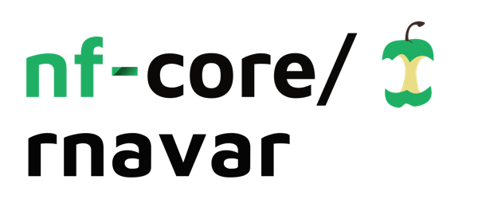

<h1>
  <picture>
    <source media="(prefers-color-scheme: dark)" srcset="docs/images/nf-core-rnavar_logo_dark.png">
    
  </picture>
</h1>

[](https://github.com/nf-core/rnavar/actions/workflows/nf-test.yml)
[](https://github.com/nf-core/rnavar/actions/workflows/linting.yml)
[](https://nf-co.re/rnavar/results)
[](https://doi.org/10.5281/zenodo.6669636)
[](https://www.nf-test.com)

[](https://www.nextflow.io/)
[](https://github.com/nf-core/tools/releases/tag/3.3.2)
[](https://docs.conda.io/en/latest/)
[](https://www.docker.com/)
[](https://sylabs.io/docs/)
[](https://cloud.seqera.io/launch?pipeline=https://github.com/nf-core/rnavar)

[](https://nfcore.slack.com/channels/rnavar)
[](https://bsky.app/profile/nf-co.re)
[](https://mstdn.science/@nf_core)
[](https://www.youtube.com/c/nf-core)

## Introduction

**nf-core/rnavar** is a bioinformatics pipeline for RNA variant calling analysis following GATK4 best practices.

## Pipeline summary

1. Merge re-sequenced FastQ files ([`cat`](http://www.linfo.org/cat.html))
2. Read QC ([`FastQC`](https://www.bioinformatics.babraham.ac.uk/projects/fastqc/))
3. (Optionally) Extract UMIs from FASTQ reads ([`UMI-tools`](https://github.com/CGATOxford/UMI-tools))
4. Align reads to reference genome ([`STAR`](https://github.com/alexdobin/STAR))
5. Sort and index alignments ([`SAMtools`](https://sourceforge.net/projects/samtools/files/samtools/))
6. Duplicate read marking ([`Picard MarkDuplicates`](https://gatk.broadinstitute.org/hc/en-us/articles/360037052812-MarkDuplicates-Picard))
7. Scatter one interval-list into many interval-files ([`GATK4 IntervalListTools`](https://gatk.broadinstitute.org/hc/en-us/articles/4409917392155-IntervalListTools-Picard-))
8. Splits reads that contain Ns in their cigar string ([`GATK4 SplitNCigarReads`](https://gatk.broadinstitute.org/hc/en-us/articles/4409917482651-SplitNCigarReads))
9. Estimate and correct systematic bias using base quality score recalibration ([`GATK4 BaseRecalibrator`](https://gatk.broadinstitute.org/hc/en-us/articles/4409897206043-BaseRecalibrator), [`GATK4 ApplyBQSR`](https://gatk.broadinstitute.org/hc/en-us/articles/4409897168667-ApplyBQSR))
10. Convert a BED file to a Picard Interval List ([`GATK4 BedToIntervalList`](https://gatk.broadinstitute.org/hc/en-us/articles/4409924780827-BedToIntervalList-Picard-))
11. Call SNPs and indels ([`GATK4 HaplotypeCaller`](https://gatk.broadinstitute.org/hc/en-us/articles/4409897180827-HaplotypeCaller))
12. Merge multiple VCF files into one VCF ([`GATK4 MergeVCFs`](https://gatk.broadinstitute.org/hc/en-us/articles/4409924817691-MergeVcfs-Picard-))
13. Index the VCF ([`Tabix`](http://www.htslib.org/doc/tabix.html))
14. Filter variant calls based on certain criteria ([`GATK4 VariantFiltration`](https://gatk.broadinstitute.org/hc/en-us/articles/4409897204763-VariantFiltration))
15. Annotate variants ([`snpEff`](https://pcingola.github.io/SnpEff/se_introduction/), [Ensembl VEP](https://www.ensembl.org/info/docs/tools/vep/index.html))
16. Present QC for raw read, alignment, gene biotype, sample similarity, and strand-specificity checks ([`MultiQC`](http://multiqc.info/), [`R`](https://www.r-project.org/))

### Summary of tools and version used in the pipeline

| Tool        | Version |
| ----------- | ------- |
| BCFtools    | 1.20    |
| BEDtools    | 2.31.1  |
| Ensembl VEP | 113.0   |
| FastQC      | 0.12.1  |
| GATK        | 4.6.1.0 |
| mosdepth    | 0.3.10  |
| MultiQC     | 1.27    |
| Picard      | 3.3.0   |
| Samtools    | 1.21    |
| SnpEff      | 5.1     |
| STAR        | 2.7.11b |
| Tabix       | 1.20    |
| UMI-tools   | 1.1.5   |

## Usage

> [!NOTE]
> If you are new to Nextflow and nf-core, please refer to [this page](https://nf-co.re/docs/usage/installation) on how to set-up Nextflow.Make sure to [test your setup](https://nf-co.re/docs/usage/introduction#how-to-run-a-pipeline) with `-profile test` before running the workflow on actual data.

First, prepare a samplesheet with your input data that looks as follows:

`samplesheet.csv`:

```csv
sample,fastq_1,fastq_2
CONTROL_REP1,AEG588A1_S1_L002_R1_001.fastq.gz,AEG588A1_S1_L002_R2_001.fastq.gz
```

Each row represents a fastq file (single-end) or a pair of fastq files (paired end).

Now, you can run the pipeline using:

```console
nextflow run nf-core/rnavar -profile <docker/singularity/podman/shifter/charliecloud/conda/institute> --input samplesheet.csv  --outdir <OUTDIR> --genome GRCh38
```

> [!WARNING]
> Please provide pipeline parameters via the CLI or Nextflow `-params-file` option. Custom config files including those provided by the `-c` Nextflow option can be used to provide any configuration _**except for parameters**_; see [docs](https://nf-co.re/docs/usage/getting_started/configuration#custom-configuration-files).

For more details and further functionality, please refer to the [usage documentation](https://nf-co.re/rnavar/usage) and the [parameter documentation](https://nf-co.re/rnavar/parameters).

## Pipeline output

To see the results of an example test run with a full size dataset refer to the [results](https://nf-co.re/rnavar/results) tab on the nf-core website pipeline page.
For more details about the output files and reports, please refer to the
[output documentation](https://nf-co.re/rnavar/output).

## Credits

rnavar was originally written by Praveen Raj and Maxime U Garcia at [The Swedish Childhood Tumor Biobank (Barntumörbanken), Karolinska Institutet](https://ki.se/forskning/barntumorbanken).
Nicolas Vannieuwkerke at [CMGG](https://www.cmgg.be/en/) later joined and helped with further development (v 1.1.0 and forward).

Maintenance is now lead by Maxime U Garcia (now at [Seqera](https://seqera/io))

Main developers:

- [Maxime U Garcia](https://github.com/maxulysse)
- [Nicolas Vannieuwkerke](https://github.com/nvnieuwk)

We thank the following people for their extensive assistance in the development of this pipeline:

- [Harshil Patel](https://github.com/drpatelh)
- [Nicolás Schcolnicov](https://github.com/nschcolnicov)
- [Ömer An](https://github.com/bounlu)
- [Phil Ewels](https://github.com/ewels)
- [Praveen Raj](https://github.com/praveenraj2018)
- [Sarah Maman](https://github.com/SarahMaman)

## Contributions and Support

If you would like to contribute to this pipeline, please see the [contributing guidelines](.github/CONTRIBUTING.md).

For further information or help, don't hesitate to get in touch on the [Slack `#rnavar` channel](https://nfcore.slack.com/channels/rnavar) (you can join with [this invite](https://nf-co.re/join/slack)).

## Citations

If you use nf-core/rnavar for your analysis, please cite it using the following doi: [10.5281/zenodo.6669636](https://doi.org/10.5281/zenodo.6669636)

An extensive list of references for the tools used by the pipeline can be found in the [`CITATIONS.md`](CITATIONS.md) file.

You can cite the `nf-core` publication as follows:

> **The nf-core framework for community-curated bioinformatics pipelines.**
>
> Philip Ewels, Alexander Peltzer, Sven Fillinger, Harshil Patel, Johannes Alneberg, Andreas Wilm, Maxime Ulysse Garcia, Paolo Di Tommaso & Sven Nahnsen.
>
> _Nat Biotechnol._ 2020 Feb 13. doi: [10.1038/s41587-020-0439-x](https://dx.doi.org/10.1038/s41587-020-0439-x).
