# nf-core/rnavar: Output

## Introduction

This document describes the output produced by the pipeline based on a public dataset.

The directories listed below are created in the `results/` directory after the pipeline has finished. All paths are relative to the top-level results directory.

### Dataset

RNAseq data has been taken from GM12878 GIAB sample SRA Accession [SRR5665260](https://www.ncbi.nlm.nih.gov/sra/?term=SRR5665260). The dataset has 38.6 million PE reads of read length 2x151 bp from NextSeq 500 sequencing platform.

### Samplesheet

A sample sheet has been prepared in the following way to set the FASTQ files to run the analysis.

```console
sample,fastq_1,fastq_2,strandedness
GM12878,/data/GM12878/SRR5665260_1.fastq.gz,/data/GM12878/SRR5665260_2.fastq.gz,reverse
```

### Execution

The pipeline has been executed with the following command:

```console
nextflow run nf-core/rnavar -profile <institutional_config>,docker --input samplesheet.csv --genome GRCh38 --annotate_tools merge --outdir results
```

The `<institutional_config>` used in this experiment can be found [here](https://github.com/nf-core/configs/blob/master/conf/pipeline/rnavar/munin.config). However, you can create your own institutional config and place it on [nf-core/configs](https://github.com/nf-core/configs/tree/master/conf/pipeline/rnavar) and then use the config name directly in the command instead of `<institutional_config>` to use your own data and parameters.

## Pipeline overview

The pipeline is built using [Nextflow](https://www.nextflow.io/) and processes data using the following steps:

- [Preprocessing](#preprocessing)
  - [cat](#cat) - Merge re-sequenced FastQ files
- [Alignment](#alignment)
  - [STAR](#star) - Fast spliced aware genome alignment
- [Alignment post-processing](#alignment-post-processing)
  - [Picard MarkDuplicates](#picard-markduplicates) - Duplicate read marking
  - [GATK4 SplitNCigarReads](#gatk4-splitncigarreads) - Splits reads that contain Ns in their cigar string (e.g. spanning splicing events in RNAseq data)
  - [GATK4 Base Quality Score Recalibration (BQSR)](#gatk4-bqsr) - Estimate and correct systematic bias that affect the assignment of base quality scores by the sequencer
- [Variant calling](#other-steps)
  - [GATK4 HaplotypeCaller](#gatk4-haplotypecaller) - Call SNPs and indels via local re-assembly of haplotypes
- [Variant filtering](#other-steps)
  - [GATK4 VariantFiltration](#gatk4-variantfiltration) - Hard-filtering variant calls based on certain criteria
- [Variant annotation](#variant-annotation)
  - [snpEff](#snpeff)
  - [VEP](#vep)
- [QC and reporting](#qc-and-reporting)
  - [QC](#qc)
    - [FastQC](#fastqc) - Raw read QC
    - [GATK MarkDuplicates reports](#gatk-markduplicates-reports)
    - [samtools stats](#samtools-stats)
    - [snpEff reports](#snpeff-reports)
    - [VEP reports](#vep-reports)
  - [Reporting](#reporting)
    - [MultiQC](#multiqc) - Present QC for raw reads, alignment, base quality recalibration as well as variant annotation summary.
- [Workflow reporting and genomes](#workflow-reporting-and-genomes)
  - [Reference genome files](#reference-genome-files) - Saving reference genome indices/files
  - [Pipeline information](#pipeline-information) - Report metrics generated during the workflow execution

## Preprocessing

### cat

<details markdown="1">
<summary>Output files</summary>

- `fastq/`
  - `*.merged.fastq.gz`: If `--save_merged_fastq` is specified, concatenated FastQ files will be placed in this directory.

</details>

If multiple libraries/runs have been provided for the same sample in the input samplesheet (e.g. to increase sequencing depth) then these will be merged at the very beginning of the pipeline in order to have consistent sample naming throughout the pipeline. Please refer to the [usage documentation](https://nf-co.re/rnavar/usage#samplesheet-input) to see how to specify these samples in the input samplesheet.

## Alignment

### STAR

[STAR](https://github.com/alexdobin/STAR) is a read aligner designed for splice aware mapping typical of RNA sequencing data. STAR stands for *S*pliced *T*ranscripts *A*lignment to a *R*eference, and has been shown to have high accuracy and outperforms other aligners by more than a factor of 50 in mapping speed, but it is memory intensive.

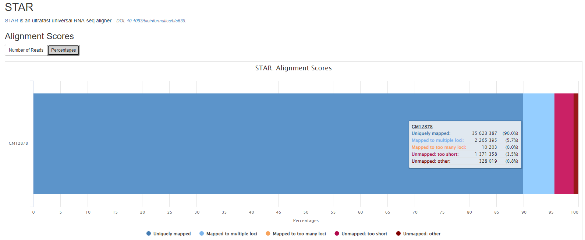

<details markdown="1">
<summary>Output files</summary>

- `preprocessing/[SAMPLE]/`
  - `[SAMPLE].aligned.bam`: If `--save_align_intermeds` is specified the original BAM file containing read alignments to the reference genome will be placed in this directory.
  - `[SAMPLE].aligned.bam.bai`: This is the index of the above \*.aligned.bam
- `preprocessing/[SAMPLE]/log`
  - `[SAMPLE].Log.final.out`: STAR alignment report containing the mapping results summary.
  - `[SAMPLE].Log.out` and `[SAMPLE].Log.progress.out`: STAR log files containing detailed information about the run. Typically only useful for debugging purposes.
  - `[SAMPLE].SJ.out.tab`: File containing filtered splice junctions detected after mapping the reads.
- `preprocessing/[SAMPLE]/unmapped`
  - `[SAMPLE].unmapped_*.fastq.gz`: If `--save_unaligned` is specified, FastQ files containing unmapped reads will be placed in this directory.
- `reports/stats/[SAMPLE]/`
  - `[SAMPLE].aligned.bam.flagstat`: Samtools flagstat summary of the alignment
  - `[SAMPLE].aligned.bam.stats`: Samtools stat output

</details>

## Alignment post-processing

### MarkDuplicates

[GATK MarkDuplicates](https://gatk.broadinstitute.org/hc/en-us/articles/360042477492-MarkDuplicates-Picard) locates and tags duplicate reads in a `BAM` file. The tool's main output is a new BAM file, in which duplicates have been identified in the SAM flags field for each read.

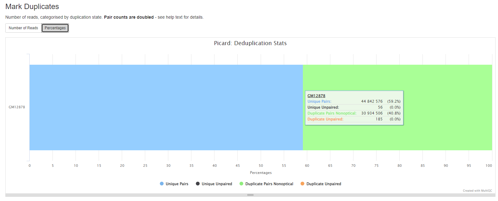

If desired, duplicates can be removed using the `--remove_duplicates true` option.

<details markdown="1">
<summary>Output files</summary>

- `preprocessing/[SAMPLE]/`
  - `[SAMPLE].markdup.sorted.bam`: Picard Markduplicate bam file.
  - `[SAMPLE].markdup.sorted.bam.bai`: This is the index of the above \*.aligned.bam

</details>

### SplitNCigarReads

[GATK SplitNCigarReads](https://gatk.broadinstitute.org/hc/en-us/articles/360036858811-SplitNCigarReads) is executed for post-processing RNA reads aligned against the reference. The tool's main output is a new BAM file with reads split at N CIGAR elements and CIGAR strings updated.

Currently, the pipeline does not produce the new BAM file in the output directory.

### Base (Quality Score) Recalibration

Base quality recalibration step runs by default and it produces the recalibrated BAM file for variant calling, as described below. However, you can turn off this step by using `--skip_baserecalibration true` option, and in that case, no recalibrated BAM file is produced and the pipeline uses the un-calibrated BAM file will be used for variant calling.

#### GATK BaseRecalibrator

[GATK BaseRecalibrator](https://gatk.broadinstitute.org/hc/en-us/articles/360042477672-BaseRecalibrator) generates a recalibration table based on various co-variates.

Currently, the pipeline does not produce the recalibration table file in the output directory.

#### GATK ApplyBQSR

[GATK ApplyBQSR](https://gatk.broadinstitute.org/hc/en-us/articles/360042476852-ApplyBQSR) recalibrates the base qualities of the input reads based on the recalibration table produced by the [GATK BaseRecalibrator](#gatk-baserecalibrator) tool.

<details markdown="1">
<summary>Output files</summary>

- `preprocessing/[SAMPLE]/`
  - `[SAMPLE].recal.bam`: Recalibrated bam file.
  - `[SAMPLE].recal.bam.bai`: This is the index of the above recalibrated bam.

</details>

## Variant calling

[GATK HaplotypeCaller](https://gatk.broadinstitute.org/hc/en-us/articles/4414586765723-HaplotypeCaller) is used to call SNVs and small indels in the sample. The `Recalibrated BAM` file is used as an input to this process and the output file is produced in VCF format.

<details markdown="1">
<summary>Output files</summary>

- `results/variant_calling/[SAMPLE]/`
  - `[SAMPLE].haplotypecaller.vcf.gz`: Variant calls in VCF format.
  - `[SAMPLE].haplotypecaller.vcf.gz.tbi`: This is the index of the above VCF file.

</details>

## Variant filtering

[GATK VariantFiltration](https://gatk.broadinstitute.org/hc/en-us/articles/360037434691-VariantFiltration) is used for hard-filtering variant calls based on certain criteria. Records are hard-filtered by changing the value in the FILTER field to something other than PASS. Filtered records will be preserved in the output.

<details markdown="1">
<summary>Output files</summary>

- `results/variant_calling/[SAMPLE]/`
  - `[SAMPLE].haplotypecaller.filtered.vcf.gz`: Variant VCF with updated FILTER field.
  - `[SAMPLE].haplotypecaller.filtered.vcf.gz.tbi`: This is the index of the above VCF file.

</details>

## Variant annotation

This directory contains results from the final annotation steps: two tools are used for annotation, [snpEff](http://snpeff.sourceforge.net/) and [VEP](https://www.ensembl.org/info/docs/tools/vep/index.html).

### snpEff

[snpeff](http://snpeff.sourceforge.net/) is a genetic variant annotation and effect prediction toolbox.
It annotates and predicts the effects of variants on genes (such as amino acid changes) using multiple databases for annotations.
The generated `VCF` header contains the software version and the used command line.

To annotate variants using `snpeff`, you can use `--annotate_tools snpeff` or `--annotate_tools merge`.
The annotated variant files in VCF format can be found in `results/variant_annotation` folder.

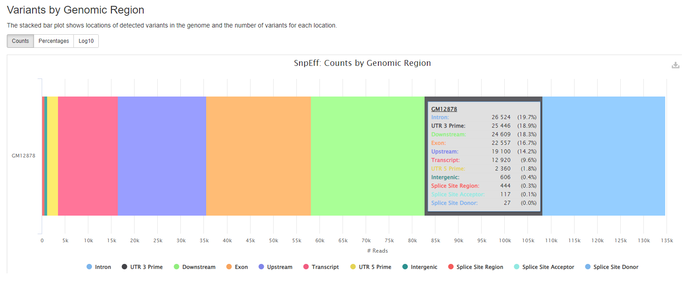
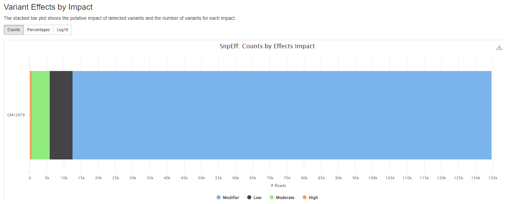
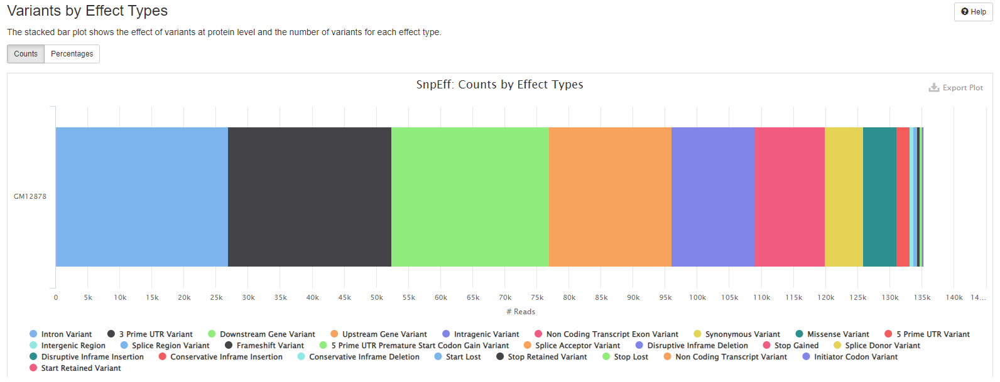
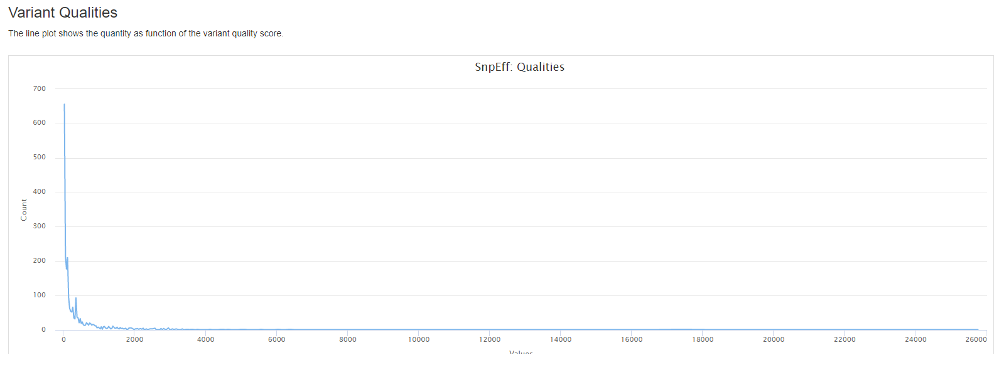

<details markdown="1">
<summary>Output files</summary>

- `results/variant_annotation/[SAMPLE]/`
  - `[SAMPLE]_snpEff.ann.vcf.gz`: Annotated VCF from snpEff process.
  - `[SAMPLE]_snpEff.ann.vcf.gz.tbi`: This is the index of the above VCF file.

</details>

For further reading and documentation see the [snpEff manual](http://snpeff.sourceforge.net/SnpEff_manual.html#outputSummary)

### VEP

[VEP (Variant Effect Predictor)](https://www.ensembl.org/info/docs/tools/vep/index.html), based on `Ensembl`, is a tool to determine the effects of the variants. The generated `VCF` header contains the software version, also the version numbers for additional databases like `Clinvar` or `dbSNP` used in the `VEP` line.
The format of the [consequence annotations](https://www.ensembl.org/info/genome/variation/prediction/predicted_data.html) is also in the `VCF` header describing the `INFO` field.

Currently, it contains:

- `Consequence`: impact of the variation, if there is any
- `Codons`: the codon change, i.e. cGt/cAt
- `Amino_acids`: change in amino acids, i.e. R/H if there is any
- `Gene`: ENSEMBL gene name
- `SYMBOL`: gene symbol
- `Feature`: actual transcript name
- `EXON`: affected exon
- `PolyPhen`: prediction based on [PolyPhen](http://genetics.bwh.harvard.edu/pph2/)
- `SIFT`: prediction by [SIFT](http://sift.bii.a-star.edu.sg/)
- `Protein_position`: Relative position of amino acid in protein
- `BIOTYPE`: Biotype of transcript or regulatory feature

To annotate variants using `vep`, you can use `--annotate_tools vep`.
The annotated variant files in VCF format can be found in `results/variant_annotation` folder.

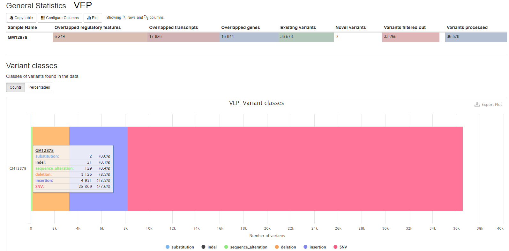

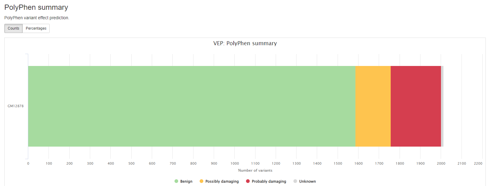

<details markdown="1">
<summary>Output files</summary>

- `results/variant_annotation/[SAMPLE]/`
  - `[SAMPLE]_VEP.ann.vcf.gz`: Annotated VCF from VEP process.
  - `[SAMPLE]_VEP.ann.vcf.gz.tbi`: This is the index of the above VCF file.

</details>

When `--annotate_tools merge` option is used, the annotation from both `snpeff` and `vep` are combined into a single VCF file which can be found with the following naming convention.

<details markdown="1">
<summary>Output files</summary>

- `results/variant_annotation/[SAMPLE]/`
  - `[SAMPLE]_snpEff_VEP.ann.vcf.gz`: Combined annotation from both snpEff and VEP.
  - `[SAMPLE]_snpEff_VEP.ann.vcf.gz.tbi`: This is the index of the above VCF file.

</details>

For further reading and documentation see the [VEP manual](https://www.ensembl.org/info/docs/tools/vep/index.html)

## QC and Reporting

### QC

#### FastQC

[FastQC](http://www.bioinformatics.babraham.ac.uk/projects/fastqc/) gives general quality metrics about your sequenced reads. It provides information about the quality score distribution across your reads, per base sequence content (%A/T/G/C), adapter contamination and overrepresented sequences. For further reading and documentation see the [FastQC help pages](http://www.bioinformatics.babraham.ac.uk/projects/fastqc/Help/).

Plots will show:

- Sequence counts for each sample.
- Sequence Quality Histograms: The mean quality value across each base position in the read.
- Per Sequence Quality Scores: The number of reads with average quality scores. Shows if a subset of reads has poor quality.
- Per Base Sequence Content: The proportion of each base position for which each of the four normal DNA bases has been called.
- Per Sequence GC Content: The average GC content of reads. Normal random library typically have a roughly normal distribution of GC content.
- Per Base N Content: The percentage of base calls at each position for which an N was called.
- Sequence Length Distribution.
- Sequence Duplication Levels: The relative level of duplication found for every sequence.
- Overrepresented sequences: The total amount of overrepresented sequences found in each library.
- Adapter Content: The cumulative percentage count of the proportion of your library which has seen each of the adapter sequences at each position.

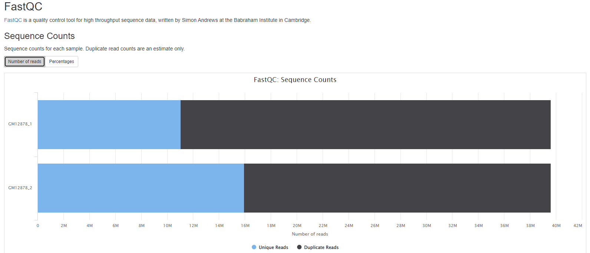

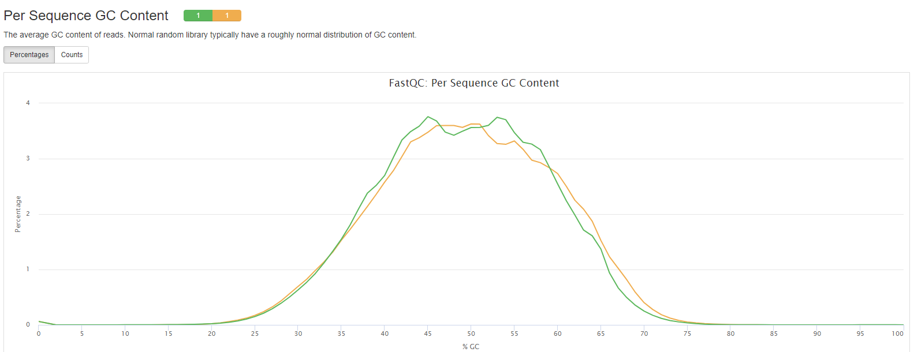
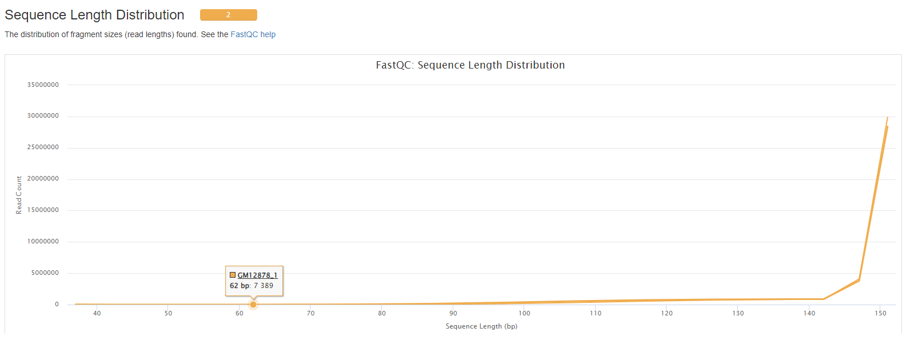
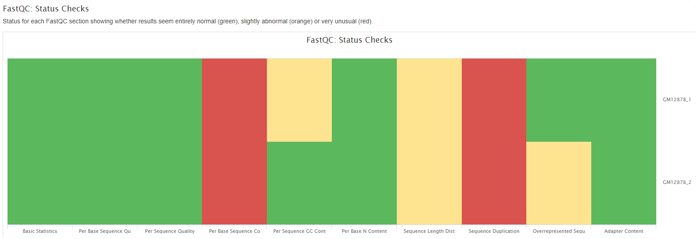

#### GATK MarkDuplicates reports

More information in the [GATK MarkDuplicates section](#gatk-markduplicates)

Duplicates can arise during sample preparation _e.g._ library construction using PCR.
Duplicate reads can also result from a single amplification cluster, incorrectly detected as multiple clusters by the optical sensor of the sequencing instrument. These duplication artifacts are referred to as optical duplicates.

<details markdown="1">
<summary>Output files</summary>

- `reports/stats/[SAMPLE]/`
  - `[SAMPLE].markdup.sorted.metrics`: Information about the number of duplicate reads in the sample.

</details>

For further reading and documentation see the [MarkDuplicates manual](https://software.broadinstitute.org/gatk/documentation/tooldocs/4.1.2.0/picard_sam_markduplicates_MarkDuplicates.php).

#### samtools stats

[samtools stats](https://www.htslib.org/doc/samtools.html) collects statistics from `BAM` files and outputs in a text format.

Plots will show:

- Alignment metrics.

<details markdown="1">
<summary>Output files</summary>

- `results/reports/stats/[SAMPLE]/`
  - `[SAMPLE].aligned.bam.flagstat`: Samtools flagstat output on raw alignment BAM.
  - `[SAMPLE].aligned.bam.stats`: Samtools stats on raw alignment BAM.
  - `[SAMPLE].markdup.sorted.bam.flagstat`: Samtools flagstat output on markduplicated BAM.
  - `[SAMPLE].markdup.sorted.bam.stats`: Samtools flagstat output on markduplicated BAM.
  - `[SAMPLE].recal.bam.stats`: Samtools flagstat output on recalibrated BAM.

</details>

For further reading and documentation see the [`samtools` manual](https://www.htslib.org/doc/samtools.html#COMMANDS_AND_OPTIONS)

#### snpEff reports

[snpeff](http://snpeff.sourceforge.net/) is a genetic variant annotation and effect prediction toolbox.
It annotates and predicts the effects of variants on genes (such as amino acid changes) using multiple databases for annotations.

Plots will shows :

- locations of detected variants in the genome and the number of variants for each location.
- the putative impact of detected variants and the number of variants for each impact.
- the effect of variants at protein level and the number of variants for each effect type.
- the quantity as function of the variant quality score.

<details markdown="1">
<summary>Output files</summary>

- `results/reports/SnpEff/[SAMPLE]/`
  - `[SAMPLE].csv`: Summary of variants by chromosome, region, effect, impact, functional class, type, etc.
  - `[SAMPLE].genes.txt`: TXT (tab separated) summary counts for variants affecting each transcript and gene.
  - `snpEff_summary.html`: Statistics with graphs to be viewed with a web browser

</details>

#### VEP reports

[VEP (Variant Effect Predictor)](https://www.ensembl.org/info/docs/tools/vep/index.html), based on `Ensembl`, is a tools to determine the effects of all sorts of variants, including SNPs, indels, structural variants, CNVs.

<details markdown="1">
<summary>Output files</summary>

- `results/reports/EnsemblVEP/[SAMPLE]/`
  - `[SAMPLE].summary.html`: Statistics with graphs to be viewed with a web browser

</details>

For further reading and documentation see the [VEP manual](https://www.ensembl.org/info/docs/tools/vep/index.html)

### Reporting

#### MultiQC

[MultiQC](http://multiqc.info) is a visualization tool that generates a single HTML report summarizing all samples in your project.
Most of the pipeline QC results are visualised in the report and further statistics are available in the report data directory.

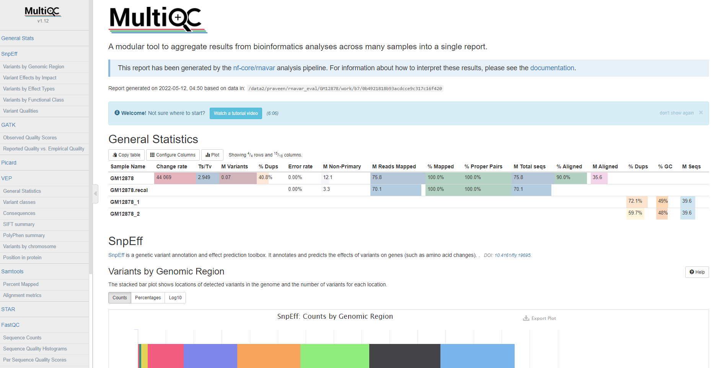

The pipeline has special steps which also allow the software versions to be reported in the `MultiQC` output for future traceability.

For more information about how to use `MultiQC` reports, see [https://multiqc.info](https://multiqc.info).

<details markdown="1">
<summary>Output files</summary>

- `reports/`
  - `multiqc_report.html`: a standalone HTML file that can be viewed in your web browser.
  - `multiqc_data/`: directory containing parsed statistics from different tools used in the pipeline.
  - `multiqc_plots/`: directory containing static images from the report in various formats.

</details>

## Pipeline information

<details markdown="1">
<summary>Output files</summary>

- `pipeline_info/`
  - Reports generated by Nextflow: `execution_report.html`, `execution_timeline.html`, `execution_trace.txt` and `pipeline_dag.dot`/`pipeline_dag.svg`.
  - Reports generated by the pipeline: `pipeline_report.html`, `pipeline_report.txt` and `software_versions.yml`. The `pipeline_report*` files will only be present if the `--email` / `--email_on_fail` parameter's are used when running the pipeline.
  - Reformatted samplesheet files used as input to the pipeline: `samplesheet.valid.csv`.

</details>

[Nextflow](https://www.nextflow.io/docs/latest/tracing.html) provides excellent functionality for generating various reports relevant to the running and execution of the pipeline. This will allow you to troubleshoot errors with the running of the pipeline, and also provide you with other information such as launch commands, run times and resource usage.
